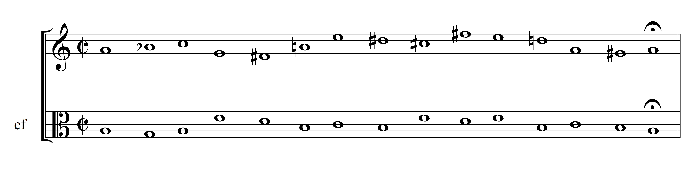

# iccc-21

Supplemental material for "In the Name of Creativity: En Route to Inspiring Machines"

*For better audio experience, please use headphones when listening.*

----------
## Sound clips for the figures:

<table>
<tr><td>
<a href="https://soundcloud.com/iccc-21/Figure-3"></a>
Figure 3: An example of a generated phrase of First Species Counterpoint.<br><a href="https://soundcloud.com/iccc-21/Figure-3">Listen</a>
</td></tr>
<tr><td>
<a href="https://soundcloud.com/iccc-21/Figure-5"></a>
Figure 5: An example of a phrase of an organum motet generated from the replaced gamut graph, based on the cantus firmus in Figure 3.<br><a href="https://soundcloud.com/iccc-21/Figure-5">Listen</a>
</td></tr>
</table>

----------

## More examples of Organum Motets with both types of contrapuntal parts

* [with diatonic contrapuntal parts](diatonic.md)
* [with chromatic contrapuntal parts](chromatic.md)

----------

## A Brief Guide to the Source Code

The source code for proof of concept of this paper is largely based on our previous work "Contrapuntal composition and autonomous style development of organum motets by using AntsOMG" (2021). The part for this paper had been added to the original repository as an alternative implementation and can be triggered with adding a `CHROMATIC` flag described as follows.

### Prerequisite

* JDK 16
* [Apache Maven](https://maven.apache.org/) 3.6.3+
* Git

### Clone and Build

```
git clone https://github.com/nclab/om.composer
cd om.composer/code
mvn clean install
```

### A Quick Run in Test Mode

You can get a quick first glance of the outcome music with the `TEST` flag, as described in the previous work.

To obtain the organum motets with diatonic contrapuntal parts, simply execute the original command:

```
mvn verify -Dexec.args="TEST"
```

The generated music files in `.musicxml` format can be found in a folder named `/ORGANUM.MOTET_TEST` under `/_projects` folder .

To obtain the organum motets with chromatic contrapuntal parts, just add `CHROMATIC` flag as an argument:

```
mvn verify -Dexec.args="TEST CHROMATIC"
```

The generated music files can be found in `/ORGANUM.MOTET_TEST_CHR` under `/_projects` folder .

All `.musicxml` files can be viewed with music notation softwares like [MuseScore](https://musescore.org/) or online viewers like [Open Sheet Music Display](https://opensheetmusicdisplay.github.io/demo/).

### A Full Run Based On Specified Cantus Firmus Collections

The following command will produce ten Organum Motets per composer by default, with full style model development process. As mentioned previously, you can obtain the Organum Motets with chromatic contrapuntal parts by adding `CHROMATIC` flag:

```
mvn verify -Dexec.args="CF=GENERATE_CF_02-18-58-824635800 CHROMATIC"
```

This will take much longer time to finish. The result will be stored in a folder named with `ORGANUM.MOTET` as prefix and `_CHR` as suffix under `/_projects` folder.

----------

## Use

Please cite

> Chang, C.-y., & Chen, Y.-p. (2021). In the Name of Creativity: En Route to Inspiring Machines. In <i>Proceedings of the 12th International
Conference on Computational Creativity (ICCC &rsquo;21)</i> (pp. 400-404). URL: [https://e.cctcc.art/iccc-2021](https://e.cctcc.art/iccc-2021).
